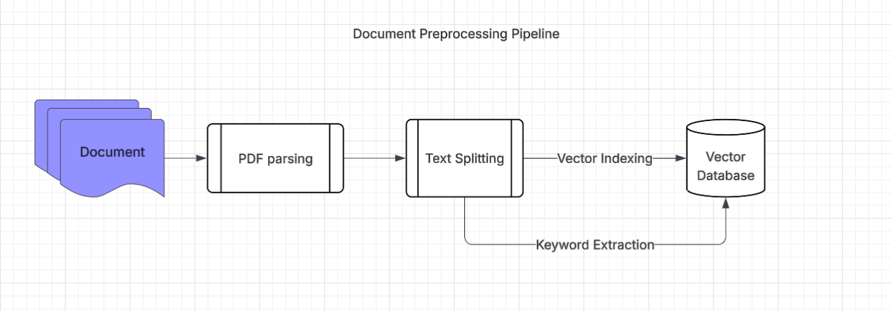
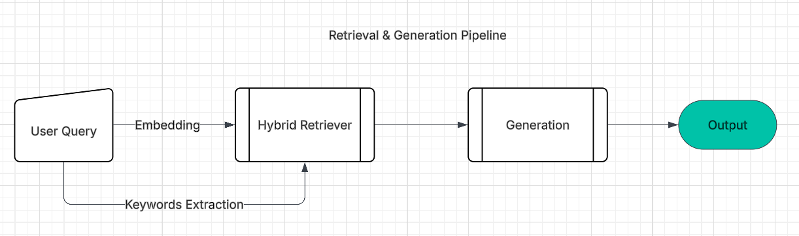

# Document-RAGx

## Purpose 

This project aims to provide the end-to-end interface for RAG from documents. 

## Version 1.0 

### Structure  

#### Frameworks & Tools  

    - LLM is self-hosted using ollama: llama3.2  

[llama3.2 Model Link](https://ollama.com/library/llama3.2:3b)

    - Python 3.11.9 
    
    - LangChain 0.3.26 

    - instructor 1.9.0

    - chainlit 2.6.0

#### Main Engine

Document-RAGx aims to provide universal interface for hybrid retriever. 

    - Preprocessing Pipeline 

        1. A list of documents is parsed using PyMuPDF implemented in LangChain. 
        2. Parsed documents are splitted using RecursiveCharacterTextSplitter.
        3. Keywords are extracted first from documents using structured-output-generation by instructor leveraging llama3.2. 
        4. Extracted keywords and embeddings are stored in Chroma Vector DB. 

    - Retrieval & Generation Pipeline 

        1. Keywords are extracted from user's query. 
        2. Extracted keywords and embedding of the query is used for hybrid retrieval. 
        3. Retrieved result is used for further generation. 

### Front-End & Back-End

    Chat interface is implemented using chainlit

### How to use

#### Preprocess 

- Run `python preprocess.py --data_dir ./data --strategy naive --mode new`

    - `data_dir` could be an arbitrary directory containing PDF files. 

    - `strategy` should be `naive`. Currently only `naive` strategy (simple hybrid retrieval & generation) is implemented. 

    - `mode` could be `new` or `add`. 
    
        In `new` mode generates a new `snapshot.json` that represents all the documents inside the data directory and creates knowledge base. 
        
        In `add` mode determines the new files based on the original `snapshot.json` and add additional documents to knowledge base.   

#### Execute

- Activate virtual environment `.venv\Scripts\activate`

    - Make sure you installed required [packages](./requirements.txt)

- chainlit run app.py 

- Visit http://localhost:8000

### PS 

If you have any issues, please visit [here](https://github.com/tatra-labs/Document-RAGx/issues) and leave me a message! :-)

